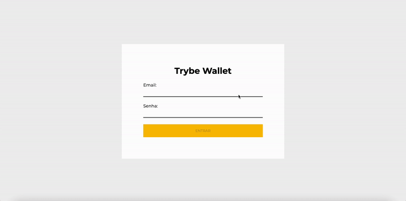

# Trybe Wallet Project



This project is a expense tracker app with currency conversion.

## Technologies

HTML, CSS, JavaScript, ReactJS, Redux.

## How to download and run the project

- Clone the repository:

```
    git clone git@github.com:MarianeAlgayer/trybe-wallet-project.git
```

- Navigate into the project directory:

```
    cd trybe-wallet-project
```

- Install dependencies:

```
    npm install
```

- Run the project:

```
    npm start
```

## Deploy

You can also access the project here: [deploy link](https://trybe-wallet-project-marianealgayer.vercel.app/).
